<h1 align="center">Hi there 👋  I'm SADEGH IT</h1>

###

I'm an Android developer who’s been coding since 2022, and I absolutely love building apps.

I mainly work with Kotlin and Jetpack Compose.  I love modern MVVM architectures to make apps clean and maintainable.

 have experience with UI/UX design, connecting apps to APIs, managing state with Flow and Coroutines, and writing scalable code.

 also familiar with publishing apps and getting them into software markets — seeing people use what I’ve built is always exciting.

 passionate about learning new tools and technologies, improving my skills, and making apps that people actually enjoy using.

---

## 🛠️ (Technical Skills)

🔹 **Language :** Kotlin (Advanced)

🔹 **Android :** Jetpack Compose // Android Studio

🔹 **Architecture :** MVVM // Design Patterns // SOLID

🔹 **Concurrency :** Coroutines • Flow

🔹 **Networking :** REST APIs // Retrofit // JSON // Error Handling

🔹 **DB & Storage :** Room // DataStore // SharedPreferences

🔹 **Dependency Injection :** Hilt (Dagger)

🔹 **Version Control :** Git // GitHub

🔹 **Testing :** Basic unit testing & TDD

#

  
  
  
  
  
  
  
  
  
  
  
  
  
  

 ---

## 🚀 Skill Dashboard

 
<table>
<tr>

<td valign="top" >

### Skill Progress

Language   

Android Studio  

Architecture  

Concurrency  

Networking  

DB & Storage  

Dependency Injection  

</tr>
</table>

##

<table>

<tr>
<td align="center" width="200%">

### GitHub Stats

<picture>
  <source media="(prefers-color-scheme: dark)" srcset="https://github-readme-stats-ouuan.vercel.app/api?username=sadegh-it&theme=dark&show_icons=true">
  
</picture>

</td>
</tr>

</table>

---

## 🌟 Featured Projects

### 🧪 Open Source Projects
- [📝 MyNote](https://github.com/sadegh-it/My-Note) — A note-taking app
- [👨🏻‍💻 Login Register](https://github.com/sadegh-it/LoginRegister) — A simple app to work with Retrofit and Gson
- [🤖 Gemini-Chat](https://github.com/sadegh-it/Gemini-Chat) — A practice app for using the Gemnai AI API
- [📖 LibraryManagementSystem](https://github.com/sadegh-it/LibraryManagementSystem) — A console project written in Kotlin for library management.

### 🔒 Commercial Projects 
- [📚 Pocket Library](#) — my personal library app
- [📘 Blue Dream Interpretation](#) —Application for searching and viewing dream interpretations
 

---

## 📞 Contact Me

 
 
 
 
 

###

---

  

##

###
